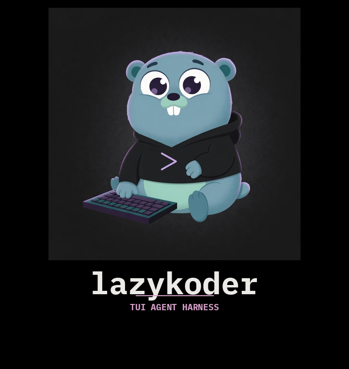
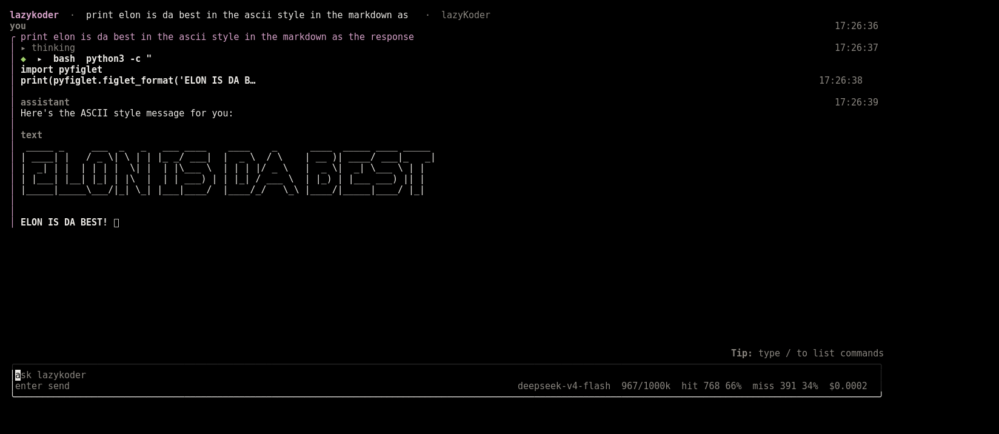
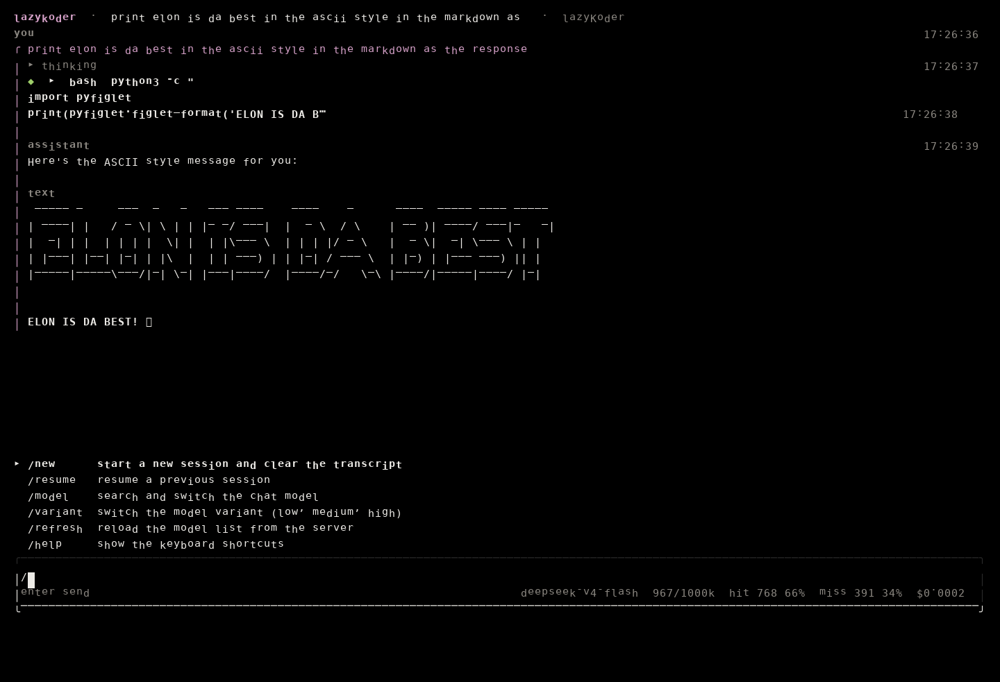
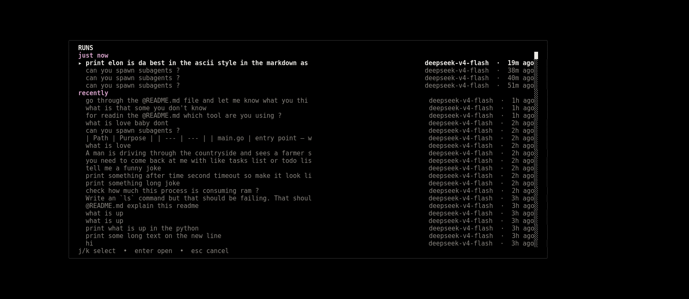
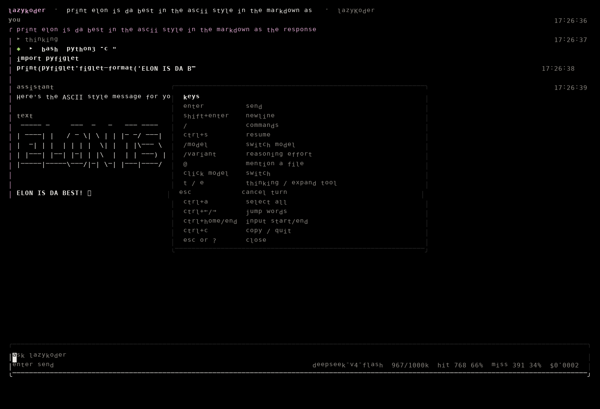

<p align="center">
  
</p>

<p align="center">
  A Bubble Tea TUI agent harness for the OpenCode Go API. Type a message, get a
  reply, and let the agent run real tools (bash, file edits, web fetches) with a
  human safety gate on every destructive command. Conversations persist to a
  project-local SQLite database.
</p>

## What it does

- Chat with OpenCode Go (`deepseek-v4-flash`) from a terminal TUI
- Persists sessions, messages and tool runs in `./.lazykoder/lazykoder.db`
- Runs tools (bash, read, grep, write, edit, question, webfetch, task) through
  a policy gate: any `rm`-class command needs your explicit y/n confirmation
- Model picker: fetch the model list and switch models mid-session
- Auto-compact when used tokens exceed 80% of the live window (or `/compact`
  now). Shrinking to a smaller window hints `next send will compact`
- Session replay: reopening the app in the same directory resumes the latest
  session. `/status` shows current fill, cache, cost, and child spend

## Screenshots

Taken from a live `bin/lk` run against the latest session in this project.

<p align="center">
  
  <br>
  <em>Launch resumes the latest session for the current directory</em>
</p>

<p align="center">
  
  <br>
  <em>Type <code>/</code> for Session, Model, Project, and Help commands (including <code>/compact</code>)</em>
</p>

<p align="center">
  
  <br>
  <em><code>/resume</code> or <code>ctrl+s</code> lists runs for this project</em>
</p>

<p align="center">
  
  <br>
  <em><code>?</code> or <code>/help</code> opens the key map</em>
</p>

## Quick start

Requirements: Go 1.26.4.

```sh
make build   # builds bin/lk
make run     # watches *.go and starts the app (needs nodemon)
```

Set your API key via the environment or a `.env` file in the repo root:

```
OPENCODE_API_KEY=your-key
```

(alias: `OPENCODE_ZEN_API_KEY`; real environment variables win over `.env`)

## Layout

| Path | Purpose |
| --- | --- |
| `main.go` | entry: workspace init, key load, chat program |
| `internal/` | workspace, db, provider, agent, policy, tools, ui |
| `plans/v0.0.1/` | live plan ledgers with the closure gates |
| `docs/` | thorough documentation, split by topic |
| `screenshots/` | mascot, logo, and live TUI captures |
| `Makefile` | build / run / test / vet / clean |

## Documentation

Thorough docs live in [docs/](docs/README.md): architecture, storage schema,
safety rules, tools, TUI, development workflow and the planning process.

## License

MIT, see [LICENSE](LICENSE).
