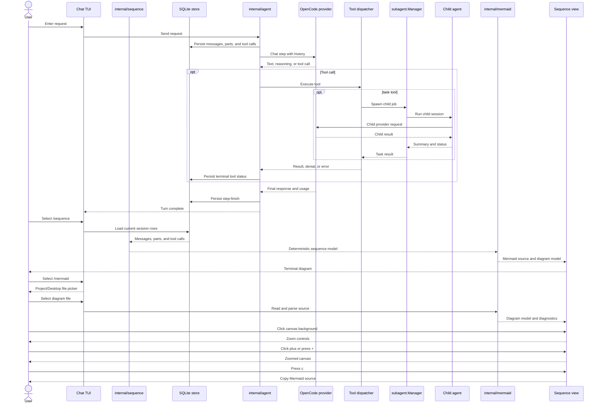

# v0.0.3 - Mermaid visualizer

> **Parent:** `plans/v0.0.2/` - agent loop, persistence, and sub-agent sessions
> **Status:** planned
> **Scope:** load and visualize Mermaid diagrams in the terminal
> **Dependency policy:** no new dependency in v1

## Goal

Add a full-screen Mermaid workspace to the TUI. `/mermaid` (alias `/diagram`)
loads a Mermaid source file, while `/sequence` (alias `/seq`) visualizes the
current main session as a generated Mermaid `sequenceDiagram`. Both entry
points use the same parser, diagram model, canvas, source view, and zoom
controls.

Mermaid is a first-class input and output format. The visualizer will:

- load `.mmd` and `.mermaid` files from the project and `$HOME/Desktop` when
  that directory exists;
- extract a selected fenced `mermaid` block from Markdown files;
- detect the Mermaid diagram family and dispatch to a type-specific parser and
  terminal renderer;
- support generated sequence diagrams from persisted messages, parts, tools,
  and sub-agent calls;
- show a terminal-native rendering because Bubble Tea cannot render browser
  Mermaid output directly;
- preserve the original source and copy it to the clipboard;
- expose source mode and a line-level diagnostic whenever a construct cannot be
  rendered, rather than showing a blank or misleading canvas.

Full Mermaid support means every supported top-level Mermaid diagram family is
registered with a parser, a renderer, fixtures, and a source fallback. The
implementation is phased because Mermaid has separate grammars for graph,
sequence, class, state, entity relationship, timeline, chart, and other
families. Unsupported syntax is an explicit diagnostic, never a silent
success. A browser, `mmdc`, and a Mermaid runtime dependency are not required
for the native renderer.

## Planned structure

| Area | Responsibility |
| --- | --- |
| `internal/sequence` | Pure projection from stored session rows to trace events |
| `internal/mermaid` | Source loading, type detection, shared IR, parsers, serializers |
| `internal/ui/mermaid` | Full-screen canvas, source view, pan, zoom, and diagnostics |
| `internal/ui/chat` | Slash routing, file selection, viewport state, and resize |
| `docs/architecture.md` | Trace and Mermaid boundaries |
| `docs/tui.md` | Command, keys, empty/error states, width behavior |
| `docs/plans.md` | Register this planned version |

No schema migration is required. The existing `ListMessages`, `ListParts`,
`ListToolCalls`, and child-session APIs are the source of truth for generated
sequence diagrams. Loaded files remain read-only and are not persisted in the
database in v1.

## Planned phases

| File | Goal |
| --- | --- |
| [phase-1-mermaid-sequence.md](phase-1-mermaid-sequence.md) | Shared contract and trace-backed sequence diagrams |
| [phase-2-mermaid-loading.md](phase-2-mermaid-loading.md) | File loading, Markdown fences, type detection, and parser registry |
| [phase-3-mermaid-canvas.md](phase-3-mermaid-canvas.md) | Full-screen terminal canvas, mouse controls, pan, zoom, and source mode |
| [phase-4-mermaid-type-coverage.md](phase-4-mermaid-type-coverage.md) | Native renderer coverage for every registered Mermaid family |

## User flows

### Session trace

1. The user finishes or reopens a main session.
2. The user selects `/sequence` or `/seq` while the chat is idle.
3. The TUI loads the current session's persisted rows and projects them into a
   deterministic trace.
4. The visualizer renders the trace and exposes generated Mermaid source.

### Desktop or project file

1. The user selects `/mermaid` or `/diagram` while the chat is idle.
2. The TUI opens a read-only picker for `.mmd`, `.mermaid`, and `.md` files in
   the project and `$HOME/Desktop`.
3. If a Markdown file has multiple fenced `mermaid` blocks, the user selects a
   block before the canvas opens.
4. The visualizer detects the diagram family, renders it, and keeps the exact
   source available in source mode.

`/mermaid <path>` skips the picker. Paths are restricted to regular files under
the project directory or `$HOME/Desktop`, and file reads have a bounded size.

The view must show a useful empty state when there is no session or no stored
events. A live turn is rejected rather than showing a stale partial diagram.
Malformed files show the line number and diagnostic with a source-mode escape
hatch. They never crash the TUI.

## Canvas interaction

- Clicking an element selects it and shows its label, source line, and any
  parser diagnostic in the detail area.
- Clicking the empty canvas toggles a small floating control strip:
  `[-] 100% [+] reset`.
- Clicking `[-]`, `[+]`, or `reset` changes the discrete zoom level without
  leaving the diagram view. Clicking the empty canvas again hides the strip.
- `+`/`=` and `-` zoom in and out; `0` resets to 100%; the mouse wheel zooms
  while the pointer is over the canvas.
- Arrow keys or `h`/`j`/`k`/`l` pan the canvas at zoom levels where the full
  diagram does not fit.
- `s` toggles source mode, `c` copies the original or generated Mermaid source,
  `r` reloads the selected file, and `esc`/`q` returns to chat.
- Zoom levels are discrete and terminal-safe: 50%, 75%, 100%, 125%, 150%,
  and 200%. Zoom changes the canvas cell transform and viewport, not the
  source or the stored trace.

## Sequence

## Closure gates

- [ ] Pure trace projection tests pass for text-only, multi-step, tool success,
  denied/error tools, and task calls.
- [ ] Mermaid parser and loader tests pass for supported extensions, Markdown
  fences, path restrictions, bounded reads, type detection, malformed source,
  and source preservation.
- [ ] Mermaid output tests pass for valid participants, arrows, `par` blocks,
  bounded labels, hostile text, and every registered diagram family.
- [ ] Terminal renderer tests prove every line fits at 80 and 120 columns at
  every zoom level and that pan remains bounded.
- [ ] Canvas interaction tests prove background clicks reveal controls, button
  clicks change zoom, node clicks select, source mode works, and mouse events
  do not leak into chat selection.
- [ ] Chat tests prove `/sequence` makes no provider call or database write,
  `/mermaid` loads project/Desktop files, copies source, and returns to chat.
- [ ] `go build ./...` exits 0 on the rebuilt tree.
- [ ] `go test ./... -count=1` exits 0.
- [ ] `go vet ./...` exits 0.
- [ ] Manual TUI verification passes at 80x24 and 120x36, including file load,
  sequence replay, source mode, clipboard copy, background zoom controls,
  keyboard zoom, panning, malformed input, and a multi-tool turn.
